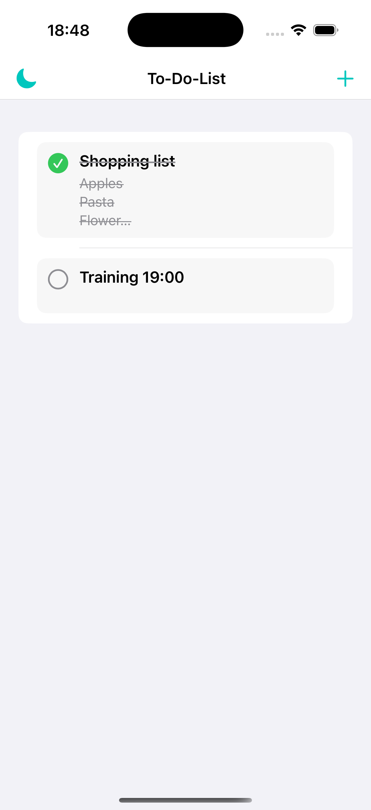
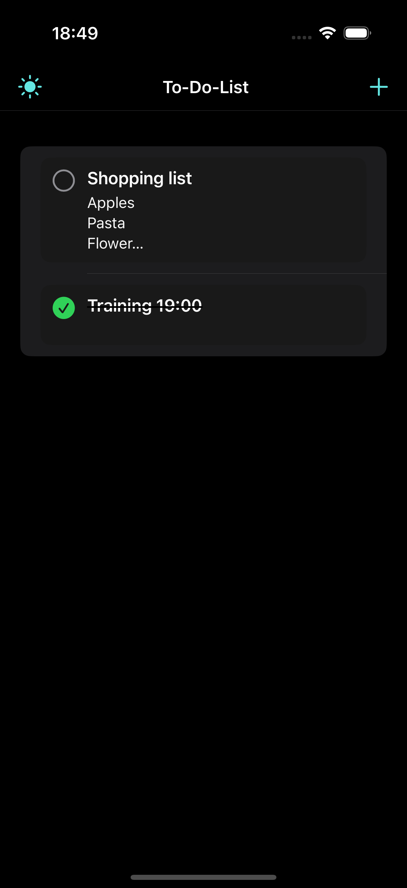
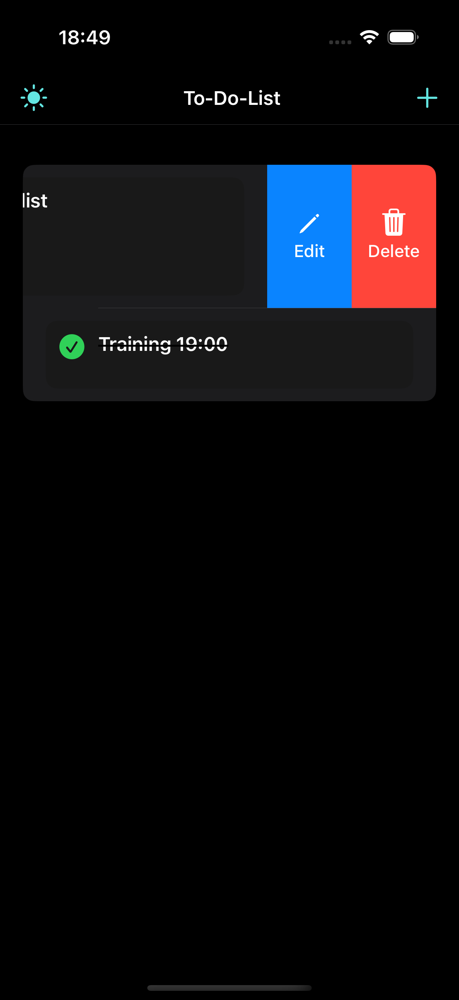
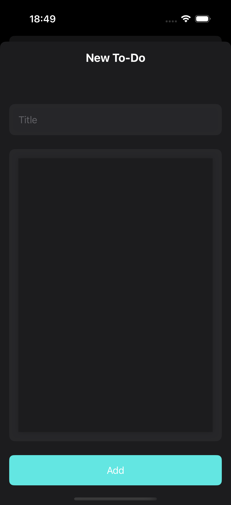

# ToDoListApp

ToDoListApp is a simple and efficient iOS app for managing your daily tasks.

---

## Features

- **Light and Dark Mode:** Switch seamlessly between light and dark themes.
- **Task Management:** 
  - Add tasks with a title and description.
  - Mark tasks as completed with a checkmark button.
  - Edit or delete tasks easily with swipe actions.
  - View tasks in a read-only mode without making any changes.
- **Task List Organization:** Keep tasks organized and visually clean.

---

## Screenshots

| Feature       | Screenshot                           |
|---------------|--------------------------------------|
| Light Mode    |  |
| Dark Mode     |    |
| Edit/Delete   |  |
| Add To-Do     |  |

---
