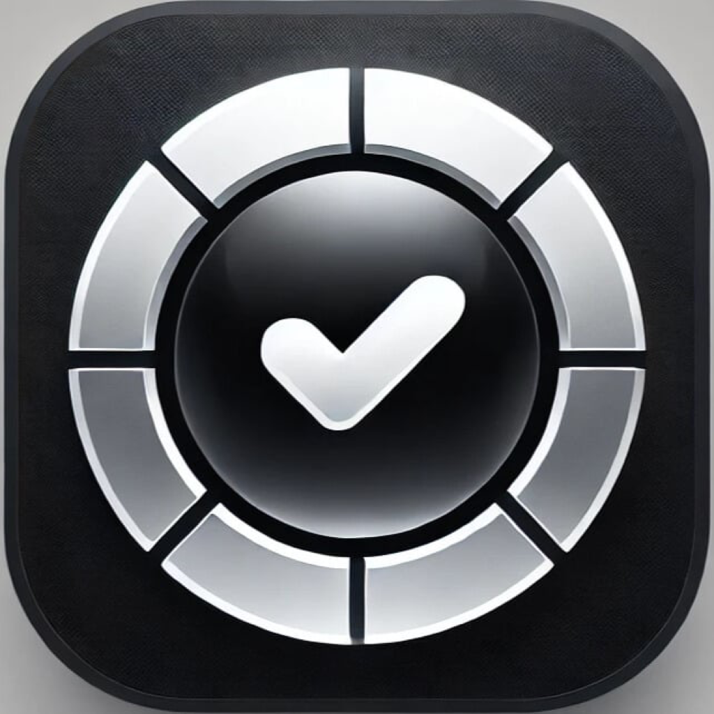

# ToDoListApp

  

A simple and efficient iOS app to manage your daily tasks with ease. Whether you're in light or dark mode, ToDoListApp helps you stay organized!

---

## Features

- 🌗 **Light and Dark Mode**: Switch seamlessly between light and dark themes.
- 📝 **Task Management**: Add tasks, mark as completed, edit, delete, or view in read-only mode.
- 📋 **Task List Organization**: Keep tasks organized and visually clean.

---

## Screenshots

<table>
  <tr>
    <td align="center"><b>Light Mode</b></td>
    <td align="center"><b>Dark Mode</b></td>
  </tr>
  <tr>
    <td></td>
    <td></td>
  </tr>
  <tr>
    <td align="center"><b>Edit/Delete</b></td>
    <td align="center"><b>Add To-Do</b></td>
  </tr>
  <tr>
    <td></td>
    <td></td>
  </tr>
  <tr>
    <td colspan="2" align="center"><b>Read Only</b></td>
  </tr>
  <tr>
    <td colspan="2" align="center"></td>
  </tr>
</table>
